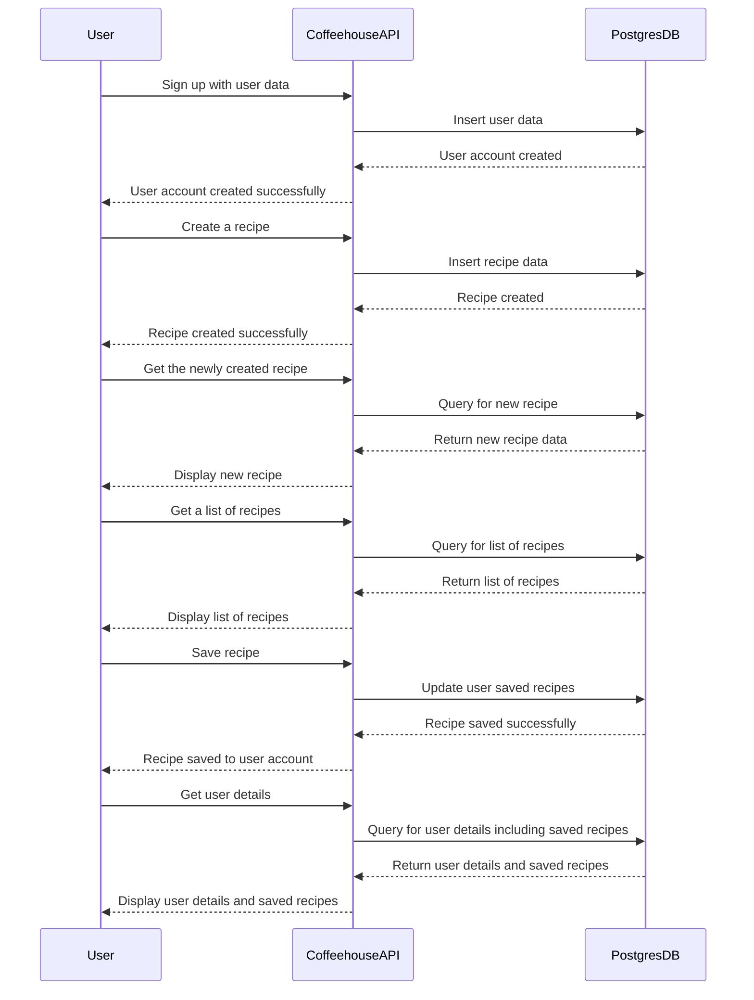
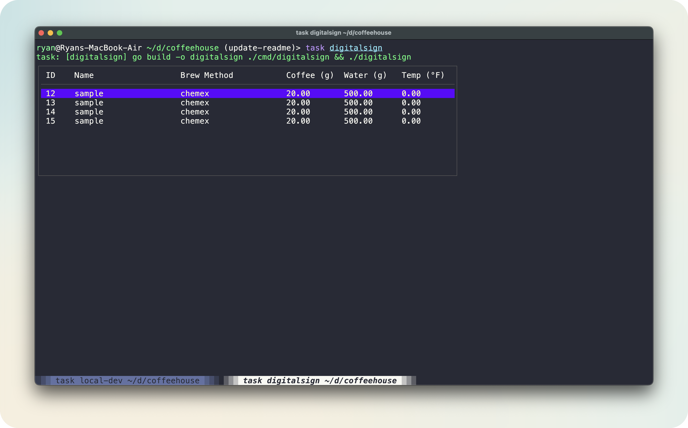
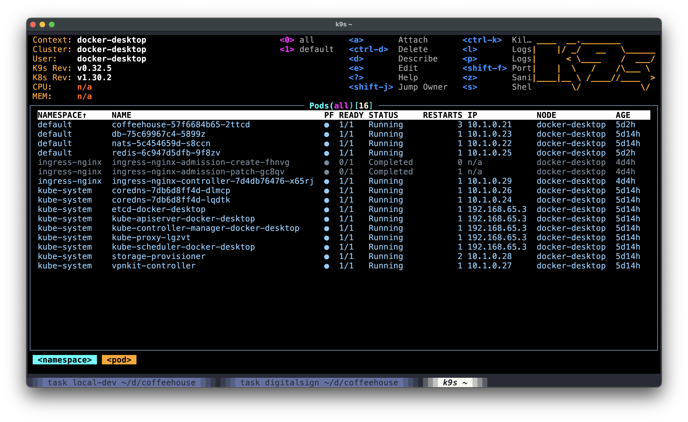

# Coffeehouse

Coffeehouse is an example/reference service for keeping records of your favorite coffee recipes.

## Common Tasks

The Taskfile is used to run common tasks that are used in development. To see all the tasks available, run `task -l`.

### Running the Application

Create a file called `docker.env` in the root of the project with the following content:
```bash
COFFEEHOUSE_DB_PASSWORD=password
COFFEEHOUSE_DB_HOST=db
COFFEEHOUSE_DB_TLS=true
COFFEEHOUSE_NATS_URL=nats://nats:4222
COFFEEHOUSE_REDIS_URL=redis:6379
COFFEEHOUSE_LISTEN_ADDR=0.0.0.0:8080
```

To run the application and see log output, run the following command:
```bash
task local-dev
```

The server should now be running and listening on port 8080.

### Sending requests to the server

The file `endpoints.http` contains example requests that can be sent to the server. You can use the [REST Client](https://marketplace.visualstudio.com/items?itemName=humao.rest-client) extension in Visual Studio Code to send the requests.

### Sequence diagram for common use case



#### Example curl requests

Create a user
```bash
curl --request POST \
  --url http://localhost:8080/v1/users \
  --header 'content-type: application/json' \
  --data '{"name": "sample","email": "sample@email.com","password": "password"}'
```

Create a recipe
```bash
curl --request POST \
  --url http://localhost:8080/v1/recipes \
  --header 'content-type: application/json' \
  --data '{"recipe_name": "sample","brew_method": "chemex","coffee_weight": 20.0,"weight_unit": "g","grind_size": 21,"water_weight": 500.0,"water_unit": "g"}'
```

Get the recipe
```bash
curl --request GET \
  --url http://localhost:8080/v1/recipes/1
```

Save the recipe for the user
```bash
curl --request POST \
  --url http://localhost:8080/v1/save-recipe \
  --header 'content-type: application/json' \
  --data '{"user_id": 1,"recipe_id": 1}'
```

Get the user which will include the saved recipes
```bash
curl --request GET \
  --url http://localhost:8080/v1/users/1
```

### Running the Command Line Digital Sign



The command line digital sign subscribes 
to the NATS topic and prints the message to the console. To run the command line digital sign, run the following command:
```bash
task digitalsign
```

Create a new recipe and the command line digital sign will display the recipe in the table.

## Kubernetes

If you have a running Kubernetes cluster, you can deploy the application using the Kubernetes deployment files. The deployment files are located in the `k8s` directory.

To deploy the application, run the following command:
```bash
kubectl apply -f k8s
```

This will create the necessary deployments, services, and secrets for the application. The application will be accessible through the service `coffeehouse`.



To access the application, you can port-forward the service to your local machine:
```bash
kubectl port-forward service/coffeehouse 8080:8080
```

The server should now be accessible on port 8080.

The Kubernetes deployment is not meant for production use and is only for demonstration purposes.

## Features

Coffeehouse includes the following features:
- RESTful API: Example CRUD operations for a coffee recipe
- Redis Caching: Example caching of the coffee recipe
- SQLC and PostgreSQL: Uses SQLC for type-safe Go from SQL and PostgreSQL for the database
- Example unit and integration tests for the server
- Docker Compose for running the server, database, nats, and redis
- Kubernetes deployment files for the server, database, nats, and redis
- Logging using Zap
- Pub/Sub using NATS
- Command line digital sign that subscribes to the NATS topic
- Taskfile for running common tasks that are used in development

## Directory
```
coffeehouse
│   routes.go - all the routes for the server
│   server.go - where the server struct is defined   
│   main.go - entry point of the application
|___cmd
│   │   digitalsign - command line digital sign
|___cache - caching interface
│   │   cache.go
|___|
|   |___redis - redis implementation
│   │   recipe.go
└───database
│   │   database.go
└───logger
│   │   logger.go
```

## Code Generation

Coffeehouse uses [sqlc](https://sqlc.dev/) for generating type-safe Go from SQL. It uses moq for mocking interfaces for use in testing.

## References

- https://github.com/benbjohnson/wtf
- https://github.com/ardanlabs/service
- https://pace.dev/blog/2018/05/09/how-I-write-http-services-after-eight-years.html
- https://brandur.org/sqlc
